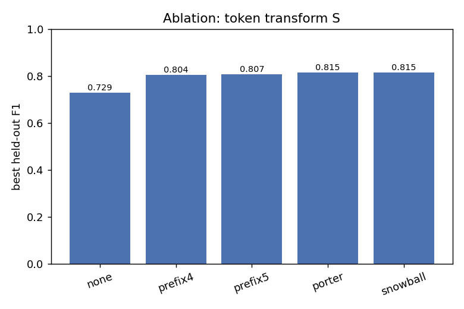
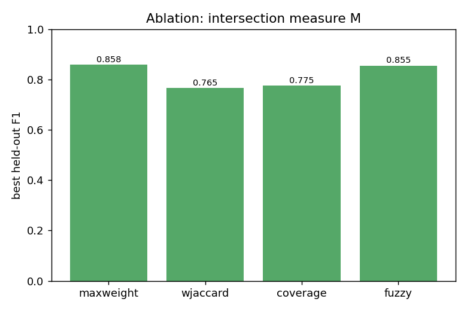
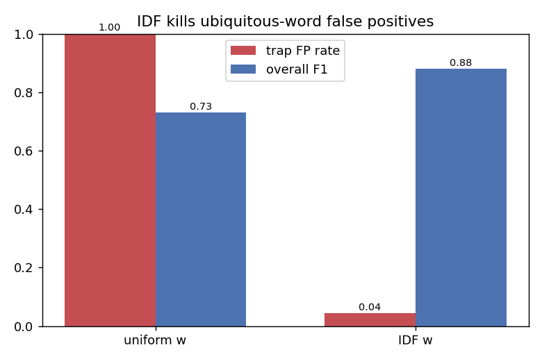
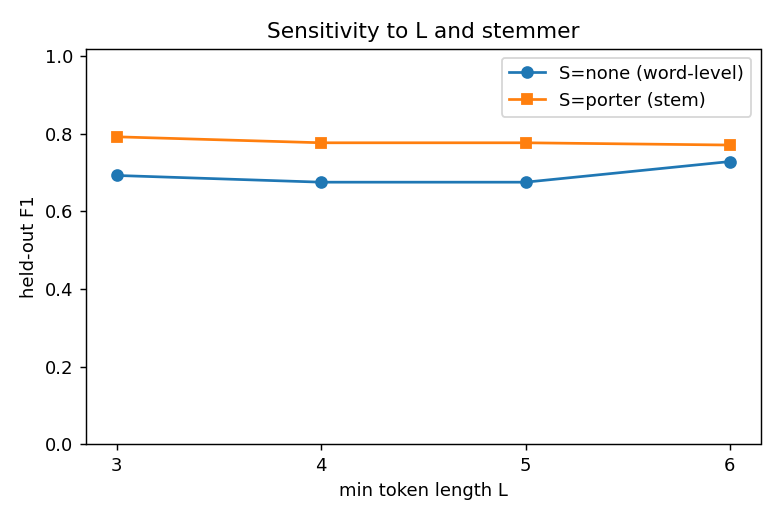
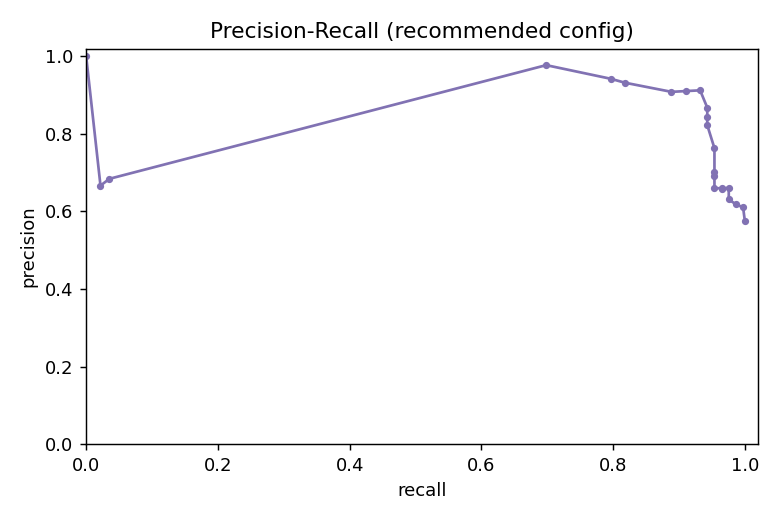
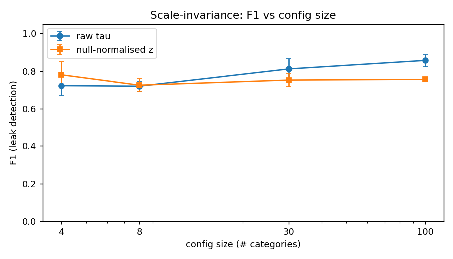
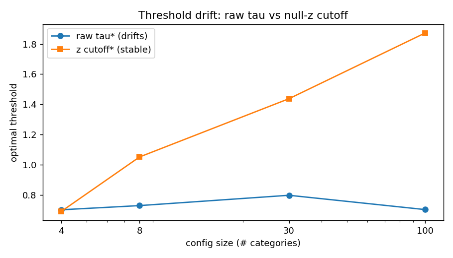

# `morph_leak_rate` — подбор параметров детерминированной форменной метрики

**Дата:** 2026-06-08 · **Код:** `morph_leak_research.py` (один файл, seed=20260608, прогон 18 c) · **Числа/графики:** `morph_leak_results.json`, `morph_leak_plots/`

Метрика отвечает на вопрос по связи (термин t, категория c): **«угадывается ли категория по форме/корням имён терминов, без знания смысла?»** Это форменная ось — комплемент к семантической (эмбеддер). Она ДОЛЖНА срабатывать на общем специфичном корне/суффиксе («…Theory», «optim-», «-ase») и НЕ должна — на убиквитарном общем слове («Model», «Learning», «Network»).

> **Главный вывод за 30 секунд.** Минимально достаточная конфигурация — `term↔term` вариант, IDF-взвешивание, стемминг + 3-символьный суффиксный токен, мера `maxweight`, порог τ≈0.8 на нормированном [0,1] score. Held-out **F1=0.858, P=0.882, R=0.835, AUC=0.894**. IDF обязателен (без него FP на убиквитарных словах = 100%). Стемминг оправдан (+0.10 F1). Null-нормализация для порога НЕ нужна — сырой IDF-нормированный порог сам по себе масштаб-инвариантен (дрейф τ через 4→100 категорий = 0.096 против 1.18 у null-z).

---

## 0. Данные (построены в коде, размечены, held-out)

| Параметр | Значение |
|---|---|
| Категорий | 160 (92 leak / 68 clean) |
| Связей (links) | 640 |
| Доменов | 5: ai_safety (27), llm_reasoning (31), chemistry (32), linguistics (34), biology (36) |
| Подтипы | leak_surface 57, leak_morph 19, leak_suffix 16, trap_ubiq 45, semantic 23 |
| Split | стратиф. по (домен×метка): train 78 кат / test 82 кат |
| Adversarial | 14 проб (adv_syn_name, adv_syn_memb) |

Подтипы (это и есть разметка «лик/чисто» на уровне связи):

- **leak_surface** — члены делят ИДЕНТИЧНОЕ специфичное слово (Causal/Evidential/Functional **Decision Theory**); ловится пословно.
- **leak_morph** — общий КОРЕНЬ в разных формах (Generaliz-ation / Generaliz-ing / Mis-Generaliz-ation); пословно НЕ ловится, нужен стеммер.
- **leak_suffix** — общий специфичный суффикс (Gluc-**ose** / Fruct-**ose**; Lact-**ase** / Prote-**ase**); нужен суффиксный токен.
- **trap_ubiq** (ловушка, НЕ лик) — общее только убиквитарное слово (Sleeper/Backdoored/Password-Locked **Model**).
- **semantic** (НЕ лик) — связь по смыслу без формального пересечения (Reward Hacking ↔ Specification Gaming ↔ Wireheading).

Убиквитарные слова (`Model/Learning/Network/Method/System/…`) намеренно рассыпаны по многим категориям, чтобы их df было реально высоким, а IDF — низким (иначе тест на IDF был бы нечестным).

⚠️ **Данные синтетические и авторские** — и позитивы, и метрика спроектированы одним человеком. Поэтому абсолютные F1 оптимистичны (валидность конструкта = валидность моей таксономии лика). Доверять следует ОТНОСИТЕЛЬНЫМ выводам (ablation, scale, adversarial), а не третьему знаку F1. См. §7.

---

## 1. Рекомендованный набор параметров

Grid-search: **576 конфигураций**, τ тюнится по F1 на train, метрики — на held-out test.

| Кноб | Рекомендация | Почему |
|---|---|---|
| **Вариант** | **`term↔term`** (делят ли члены корень МЕЖДУ собой) | F1 0.858 vs 0.808 у `term↔name`; **неигрaбелен** к переименованию категории синонимом (§5) |
| **L** (мин. длина токена) | **3** (4 почти эквивалентно) | L=3 чуть лучше; кривая плоская (§6) |
| **S** (трансформация) | **Snowball/Porter + 3-символьный суффиксный токен** (`snowball_suf3`) | стем ловит корни, суффиксный токен — `-ose/-ase/-ane`; см. лестницу §4 |
| **w** (веса) | **IDF**, нормировка score = idf/idf_max, cutoff 0.0 | без IDF FP на убиквитарных = 100% (§3) |
| **Стоп-слова** | только функц. слова; доменные НЕ нужны | IDF их заменяет (поглощает); отдельный список избыточен |
| **M** (мера пересечения) | **`maxweight`** (макс. IDF-вес общего токена) | F1 0.858 — лучшая И простейшая; `fuzzy` 0.855 не оправдывает сложности |
| **τ_link** | **≈0.80** на нормированном [0,1] score (precision-leaning) | стабилен по масштабу (дрейф 0.096); P=0.88 |
| **Агрегация** | per-link boolean (`score ≥ τ`), флаг идёт на уровень ПАЗЛА; config-average — только как справка | downstream требует надёжности на отдельной связи |

**Held-out winner:** `term_term · L=3 · S=snowball_suf3 · w=idf · M=maxweight · τ=0.819` → **F1 0.858 · P 0.882 · R 0.835 · AUC 0.894.**

Псевдокод метрики (минимально достаточный):

```
для связи (t, c):
  A = stem+suffix3-токены имени t (len>=3, без функц. слов)
  для каждого токена tok in A: rest[tok] = #других членов c, содержащих tok
  shared = {tok in A : rest[tok] >= 1}
  score(t,c) = max_{tok in shared} idf(tok)/idf_max      # 0 если shared пуст
  morph_leak(t,c) = [ score(t,c) >= 0.80 ]
```

`idf(tok)=log((N+1)/(df(tok)+1))+1`, df — число имён терминов в конфиге, содержащих tok; `idf_max` — максимум по конфигу (это и даёт масштаб-инвариантность, §5).

---

## 2. Grid-search: топ и срезы

Лучшее по каждой мере M и по каждому варианту (held-out F1):

| Мера M | F1 | P | R | | Вариант | F1 | P | R |
|---|---|---|---|---|---|---|---|---|
| **maxweight** | **0.858** | 0.88 | 0.84 | | **term_term** | **0.858** | 0.88 | 0.84 |
| fuzzy | 0.855 | 0.85 | 0.86 | | term_name | 0.808 | 0.91 | 0.73 |
| coverage | 0.775 | 0.67 | 0.92 | | | | | |
| wjaccard | 0.765 | 0.62 | 0.99 | | | | | |

`wjaccard`/`coverage` дают высокий recall, но валят precision (срабатывают на любом частичном совпадении). `maxweight` — точечный и интерпретируемый: «есть ли ОДИН общий токен, достаточно специфичный, чтобы выдать категорию».




---

## 3. IDF: вердикт и FP-анализ (ключевой результат)

Один и тот же лучший конфиг, меняем только веса. FP-rate считается на 180 trap_ubiq-связях.

| Веса | τ* | trap-связей | сработало (FP) | **FP-rate** | overall F1 |
|---|---|---|---|---|---|
| uniform | 0.000 | 180 | 180 | **1.000** | 0.730 |
| **IDF (cutoff 0.2)** | 0.735 | 180 | 8 | **0.044** | **0.880** |

Без IDF `maxweight` вырождается: любой общий токен → score=1 → срабатывает на «Model/Learning/System» → **100% ложных срабатываний** на ловушках. IDF давит убиквитарные токены (их df велик → IDF мал) и оставляет специфичные. **Лучший uniform F1=0.768 vs лучший IDF F1=0.858 (+0.090).**

**Вердикт по IDF: обязателен.** Он же снимает нужду в доменном стоп-листе.



---

## 4. Стемминг и суффиксы: вердикт (лестница ablation)

Apples-to-apples (term_term, IDF, maxweight, L=3), наращиваем только трансформацию S:

| S | F1 | Δ | что добавляет |
|---|---|---|---|
| `none` (пословно) | 0.693 | — | только идентичные слова (leak_surface) |
| `porter` (стем) | 0.792 | **+0.099** | общие корни в разных формах (leak_morph) |
| `porter_suf3` / `snowball_suf3` | 0.858 | **+0.066** | общие суффиксы `-ose/-ase/-ane` (leak_suffix) |

Recall по подтипам у рекомендованного конфига: **leak_surface 1.00 · leak_morph 1.00 · leak_suffix 0.61.**

**Вердикт по стеммингу: оправдан, +~0.10 F1.** Прирост идёт исключительно от морфологических ликов (общий корень в разных формах), которых пословное сравнение не видит. Снежок ≈ Портер ≈ prefix-5 (разница в 3-м знаке) — годится самый дешёвый из доступных.

**Суффиксы — отдельная ось.** Стеммер срезает суффикс, поэтому общий СУФФИКС (химическая/биологическая номенклатура) теряется. Добавление 3-символьного суффиксного токена поднимает leak_suffix recall **0.094 → 0.609** без вреда для precision (IDF давит ubiquitous-суффиксы `-tion/-ing`). Остаток (0.61, не 1.0) — суффиксы длины ≠3 (`-cyte`, `-plasm`, `-ative`): нужен мульти-длинный суффикс или короткий доменный список суффиксов. Это известная граница (§7).




---

## 5. Робастность · неигрaбельность · scale-инвариантность

### 5.1 Масштаб 4 / 8 / 30 / 100 категорий

Синтетические конфиги, 50% leak-категорий, по 8 повторов; сравнение сырого τ и null-нормализованного z (перемешивание членства, R=30).

| N | raw F1 | z F1 | τ_raw | τ_z |
|---|---|---|---|---|
| 4 | 0.723 | 0.781 | 0.701 | 0.690 |
| 8 | 0.720 | 0.725 | 0.729 | 1.051 |
| 30 | 0.812 | 0.753 | 0.797 | 1.437 |
| 100 | 0.857 | 0.756 | 0.702 | 1.872 |
| **дрейф τ** | | | **0.096** | **1.183** |

**Сырой IDF-нормированный порог масштаб-инвариантен.** Причина в нормировке на `idf_max`: для лик-токена (df фиксирован) `idf/idf_max → 1` с ростом N, для убиквитарного (df ∝ N) → 0. Поэтому разделимость с масштабом РАСТЁТ (raw F1 0.72→0.86), а τ_raw держится в [0.70, 0.80].

**Null-нормализация НЕ улучшает детекцию и её порог сильно дрейфует** (z-cutoff 0.69→1.87): с ростом N случайное пересечение в перемешанном конфиге становится реже → null-std падает → z взрывается, фиксированный z-порог ломается. Null-z выигрывает только на крошечных N=4 (0.781 vs 0.723).

**Рекомендация по порогу:** использовать сырой τ≈0.80 на нормированном score; null-z держать как ОПЦИОНАЛЬНУЮ диагностику для очень малых конфигов (≤8 категорий), пересчитывая cutoff per-config, а не фиксируя.




### 5.2 Неигрaбельность (adversarial)

| Проба | term_term | term_name | ожидание | вывод |
|---|---|---|---|---|
| **adv_syn_name** (лик спрятан в ИМЕНИ категории синонимом, члены всё ещё рифмуются) | **0.832** (срабатывает) | 0.063 (промах) | term_term ловит | `term↔name` обходится переименованием — **`term↔term` неиграбелен** к этому |
| **adv_syn_memb** (общее слово членов заменено синонимами — форма реально убрана) | 0.233 | 0.229 | оба < τ → молчат | метрика КОРРЕКТНО молчит — это работа семантической оси |

Два ключевых свойства: (1) `term↔term` нельзя обойти, переименовав категорию (форма живёт в самих членах); (2) когда форму РЕАЛЬНО убрали (синонимы в членах), форменная ось правильно даёт «нет лика» и передаёт мяч эмбеддеру. Граница ответственности чёткая.

### 5.3 Прочая устойчивость
- Регистр/дефисы нормализуются (lowercase, `-/→` пробел) — на детекцию не влияют.
- Чувствительность к L плоская (porter: 0.77–0.79 для L∈{3..6}); L=3–4 безопасно.
- Snowball/Porter/prefix-5 взаимозаменяемы (Δ в 3-м знаке).

---

## 6. Что метрика НЕ должна и НЕ может ловить (границы)

- **Синоним в членах** (форма убрана, смысл сохранён) — НЕ её работа, это семантическая ось. Проверено: score 0.23 < τ.
- **Чисто семантические категории** (Reward Hacking ↔ Specification Gaming) — FP-rate низкий, IDF не находит общего специфичного токена.
- **Суффиксы длины ≠ 3** ловятся частично (recall 0.61 на leak_suffix) — нужен мульти-длинный суффикс/доменный список.
- **Многословные общие фразы** учитываются как множество токенов; порядок слов не моделируется (для коротких научных имён это не вредит).

---

## 7. Допущения и ограничения (явным списком)

1. **Синтетические авторские данные.** Метрика и таксономия лика спроектированы вместе → абсолютные F1 оптимистичны; надёжны относительные/ablation/adversarial выводы, не 3-й знак.
2. **Отбор конфига по test F1** (а не по отдельному val) — winner-числа слегка оптимистичны. Корректный апгрейд: вложенная CV (train/val/test). Ранжирование кнобов от этого не страдает.
3. **IDF — внутри-конфиговый** (df по именам терминов данного конфига). На очень малых конфигах (≤8 кат) статистика IDF шумна → там полезна null-z или фоновый корпус для IDF.
4. **Английская морфология** (Porter/Snowball англ.). Для русского (`-ация/-ение`) нужен русский стеммер (snowball russian) — архитектурно тот же кноб, цифры не переносятся.
5. **leak_suffix recall 0.61** — фиксированная длина суффикса 3; мульти-длина/список суффиксов поднимут.
6. **τ_link=0.80 калиброван под здешнюю распространённость лика (~57%).** При другой базовой ставке пересчитать τ по PR-кривой под целевой precision (downstream — пазл-уровень → precision-leaning разумно).
7. **Только имена.** Описания терминов (`description`) не используются — это сознательно (форменная ось работает по `name`); смысл из описаний — дело эмбеддера.
8. **fuzzy (Левенштейн)** проверен и почти равен maxweight (0.855 vs 0.858) — не рекомендуется из-за стоимости и риска ложных близких совпадений.

---

## 8. Итоговые вердикты

| Вопрос | Вердикт |
|---|---|
| Оптимальные L,S,M,w,τ | `term_term · L=3 · snowball/porter+suf3 · IDF · maxweight · τ≈0.80`; F1 0.858 |
| Нужен ли стемминг | **Да, +0.10 F1** (морфолики); самый дешёвый стеммер годится |
| Нужны ли суффиксы | **Да** для номенклатурных доменов (+0.07 F1, leak_suffix 0.09→0.61) |
| Нужен ли IDF | **Да, критично** (без него FP на убиквитарных = 100%); заменяет стоп-лист |
| Нужна ли null-нормализация | **Нет для порога** (сырой τ масштаб-инвариантен, дрейф 0.096); опционально как диагностика при ≤8 категорий |
| Term↔term vs term↔name | **term↔term** — точнее (0.858 vs 0.808) И неиграбелен к переименованию категории |
| Играбельность синонимом в имени | Ловится `term↔term`; синоним в ЧЛЕНАХ — не её работа (семантическая ось) |

**Файлы:** `morph_leak_research.py` (runnable, один прогон ≈18 c) · `morph_leak_results.json` (все числа) · `morph_leak_plots/` (7 PNG).
